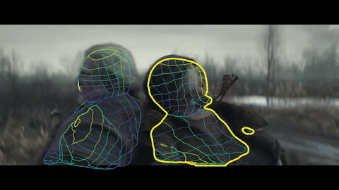

# Densepose on video

Put the .py files with your detectron installation.

##### Use command 
```
python2 tools/infer_vid.py     
--cfg configs/DensePose_ResNet101_FPN_s1x-e2e.yaml     
--output-dir DensePoseData/infer_out/    
--wts https://s3.amazonaws.com/densepose/DensePose_ResNet101_FPN_s1x-e2e.pkl 
--input-file filename
```
Note: Requires about 4GB VRAM.

If you use ResNet101_FPN_s1x model, you need more than 4GB of memory.
If you have only 4GB use ResNet50_FPN_s1x.

You can get configs and models from here.
* https://github.com/facebookresearch/DensePose/tree/master/configs
* https://github.com/facebookresearch/DensePose/blob/master/MODEL_ZOO.md
    
Additional requirement - ffmpeg

##### Tested with 
* Ubuntu 16.04
* Cuda 9.0
* CUDNN 6
* opencv 3.4
* GTX 1050 Ti
* GTX 1080 Ti

##### Example, ran on Geralt doing some witcherin'



##### And a bit of Night city.

